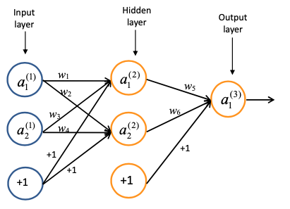

# Neural Network Forward Propagation and Backpropagation

This assignment provided in the CENG506 Deep Learning course focuses on understanding and applying forward propagation and backpropagation in a neural network. The given questions cover specific scenarios related to the activation function, loss calculation, and gradient computation. The solutions are provided in a PDF document.

## Solutions

Please refer to the `Solutions.pdf` document for the handwritten solutions to the following questions:

## Questions

### Question 1

* For the given neural network with sigmoid activation function, apply forward propagation using the provided values and read the approximate output values from the sigmoid function plot.

    \- 𝑎1(1) = 0.5 \
    \- 𝑎2(1) = 0.1 \
    \- w1 = 0.8 \
    \- w2 = 0.2 \
    \- w3 = 0.75 \
    \- w4 = 0.3 \
    \- w5 = 0.4 \
    \- w6 = 0.5 

### Question 2

* Given the desired output (ground truth) of 0.1 for the provided input, calculate the loss, L.

### Question 3

* For the same ground truth value, we would like to update w5. Calculate the partial derivative (∂L/∂w5).

### Question 4

* If the learning rate α is 0.1, calculate the updated value of w5 after the first round.

### Question 5

* Calculate the partial derivative (∂L/∂w1).

